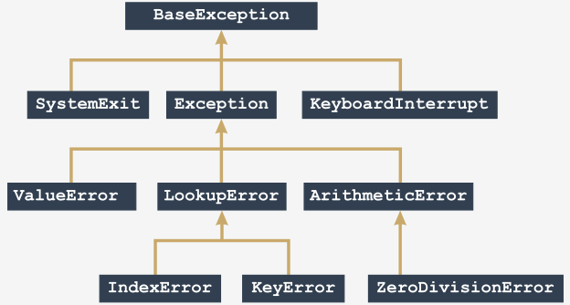

# Tratamiento de Excepciones

## Errores

Ejecutamos nuestro script `hola_mundo.py` escrito de la siguiente manera:

`print("Hola Mundo)`


En consola recibiremos el siguiente mensaje (en rojo):

```shell
/usr/bin/hola_mundo.py
  File "/hola_mundo.py", line 1
    print("Hola Mundo)
                     ^
SyntaxError: EOL while scanning string literal

Process finished with exit code 1
```

- Línea 1: El rastreo (ruta que el código atraviesa a través de diferentes partes del programa).
- Línea 2: La ubicación del error (el nombre del archivo que contiene el error, el número de línea y el nombre del módulo); 
  - Nota: el número puede ser engañoso, ya que Python generalmente muestra el lugar donde se da cuenta por primera vez de los efectos del error, no necesariamente del error en sí.
- Línea 3: El contenido de la línea errónea.
- Línea 4: La ubicación del error en la línea `^`
- Línea 5: El nombre del error (excepción) antes de los `:` y luego una breve explicación.

## Excepciones

Cada vez que tu código intenta hacer algo erróneo, irresponsable o inaplicable, Python hace dos cosas:

1. Detiene tu programa.
2. Crea un tipo especial de dato, llamado **excepción**.

Ambas actividades llevan por nombre **lanzar una excepción** o que **una excepción ha sido lanzada**.

Python proporciona herramientas efectivas que permiten observar, identificar y manejar las excepciones eficientemente. Todas las excepciones potenciales tienen un nombre específico, y podemos clasificarlas y reaccionar a ellas adecuadamente.

    Si (la excepción no es resuelta):
        el programa será terminado abruptamente, y verás un mensaje de error enviado a la consola por Python.
    sino:
        se atiende la excepción y se maneja apropiadamente, el programa puede reanudarse y continuar su ejecución.

### Palabras reservadas: `try` / `except`

Las excepciones se manejan con la palabra reservada `try` y `except`

```python
try:
    # Bloque de acciones
except:
    # Bloque de acciones

```

1. Primero, Python intenta ejecutar las instrucciones colocadas entre las instrucciones `try:` y `except:`.
2. Si no hay ningún problema con la ejecución y todas las instrucciones se realizan con éxito, la ejecución salta al punto después de la última línea del bloque `except:`, y la ejecución del bloque se considera completa.
3. Si algo sale mal dentro del bloque `try:` o el bloque `except:`, la ejecución salta inmediatamente fuera del bloque y entra en la primera instrucción ubicada después de la palabra reservada `except:`, lo que significa que algunas de las instrucciones del bloque pueden ser omitidas.

Podemos construir un bloque para cada posible excepción.

```python

try:
    # Bloque de acciones
except excepcion_1:
    # Bloque de acciones
except excepcion_2:
    # Bloque de acciones
except:
    # Bloque de acciones

```

Notas:
- Los bloques `except` son analizados en el mismo orden en que aparecen en el código.
- No debes usar más de un bloque de excepción con el mismo nombre.
- El número de diferentes bloques `except` es arbitrario, la única condición es que si se emplea `try`, debes poner al menos un `except` (nombrado o no).
- La palabra reservada `except` no debe ser empleada sin que le preceda un `try`.
- Si uno de los bloques `except` es ejecutado, ningún otro lo será.
- Si ninguno de los bloques `except` especificados coincide con la excepción planteada, la excepción permanece sin manejar (lo discutiremos pronto).
- Si un `except` sin nombre existe, tiene que especificarse como el último.

### Anatomía de las Excepciones

Python 3 define 63 excepciones integradas, y todos ellos forman una jerarquía en forma de árbol.

Algunas de las excepciones integradas son más generales (incluyen otras excepciones) mientras que otras son completamente concretas (solo se representan a sí mismas).



Notas:

- ¡El orden de las excepciones importa!
- No pongas excepciones más generales antes que otras más concretas.
- Esto hará que el último sea inalcanzable e inútil.
- Además, hará que el código sea desordenado e inconsistente.
- Python no generará ningún mensaje de error con respecto a este problema.

#### Dos o mas excepciones

Para manejar dos o más excepciones de la misma forma se puede utilizar la siguiente sintaxis:

```python
try:
    # Bloque de acciones
except (excepcion_1, excepcion_2):
    # Bloque de acciones

```

Simplemente, tienes que poner todos los nombres de excepción empleados en una lista separada por comas y no olvidar los paréntesis.

#### Excepciones dentro de funciones

Si una excepción se genera dentro de una función, puede ser manejada:

- Dentro de la función.
- Fuera de la función.

```python
# Caso 1: Excepción tratada dentro de la función
def my_function(n):
    try:
        return 1 / n
    except ArithmeticError:
        print("¡Problema aritmético!")
    return None


my_function(0)

```

```python
# Caso 2: Excepción tratada fuera de la función
def my_function(n):
    return 1 / n


try:
    my_function(0)
except ArithmeticError:
    print("¡Se lanzo una excepción!")

```

La excepción planteada puede cruzar la función y los límites del módulo, y viajar a través de la cadena de invocación buscando una cláusula `except` capaz de manejarla. 

Si no existe tal cláusula, la excepción no se controla y Python resuelve el problema de la manera estándar: terminando el código y emitiendo un mensaje de diagnóstico.

#### La sentencia `raise`

Sintaxis

```python
raise excepcion
```

La instrucción `raise` genera la excepción especificada denominada `excepcion` como si fuese generada de manera natural. 

La instrucción permite:

- Simular excepciones reales. Por ejemplo, para probar tu estrategia de manejo de excepciones.
- Parcialmente, manejar una excepción y hacer que otra parte del código sea responsable de completar el manejo.

También tenemos esta forma (sin nombre de excepción)

```python
raise
```

En este caso, la instrucción generará nuevamente la misma excepción que se maneja en la rama de `except`.

Existe una seria restricción: Esta variante de la instrucción `raise` puede ser utilizada solamente dentro de la rama `except` (usarla en cualquier otro contexto causa un error). 

#### La sentencia `assert`

Sintaxis

```python
assert expresión
```

Evalúa la expresión:

- Si la expresión se evalúa como `True` (verdadero), o un valor numérico distinto de cero, o una cadena no vacía, o cualquier otro valor diferente de `None`, no hará nada más.
- De lo contrario, automáticamente e inmediatamente genera una excepción llamada `AssertionError` (en este caso, decimos que la afirmación ha fallado).

## Excepciones Integradas

Encontrarás la documentación de las jerarquías de las excepciones integradas en este enlace de la [documentación oficial](https://docs.python.org/es/3/library/exceptions.html#exception-hierarchy).

La jerarquía de clases para las excepciones incorporadas es:

- BaseException
  - SystemExit
  - KeyboardInterrupt
  - GeneratorExit
  - Exception
    - StopIteration
    - StopAsyncIteration
    - ArithmeticError
    - FloatingPointError
      - OverflowError
      - ZeroDivisionError
    - AssertionError
    - AttributeError
    - BufferError
    - EOFError
    - ImportError
      - ModuleNotFoundError
    - LookupError
      - IndexError
      - KeyError
    - MemoryError
    - NameError
      - UnboundLocalError
    - OSError
      - BlockingIOError
      - ChildProcessError
      - ConnectionError
        - BrokenPipeError
        - ConnectionAbortedError
        - ConnectionRefusedError
        - ConnectionResetError
      - FileExistsError
      - FileNotFoundError
      - InterruptedError
      - IsADirectoryError
      - NotADirectoryError
      - PermissionError
      - ProcessLookupError
      - TimeoutError
    - ReferenceError
    - RuntimeError
      - NotImplementedError
      - RecursionError
    - SyntaxError
      - IndentationError
        - TabError
    - SystemError
    - TypeError
    - ValueError
      - UnicodeError
        - UnicodeDecodeError
        - UnicodeEncodeError
        - UnicodeTranslateError
    - Warning
      - DeprecationWarning
      - PendingDeprecationWarning
      - RuntimeWarning
      - SyntaxWarning
      - UserWarning
      - FutureWarning
      - ImportWarning
      - UnicodeWarning
      - BytesWarning
      - EncodingWarning
      - ResourceWarning

## Más sobre Excepciones

### El bloque `else:`

El código que escribas en este bloque se ejecuta si, y solo sí, no se ha generado ninguna excepción dentro del bloque `try:`. 
Podemos decir que esta rama se ejecuta después del `try:` si no se ejecutó ningún `except:`.

Semánticamente, podríamos leerlo de la siguiente manera: Si ninguna excepción se ejecuta, entonces ejecuta este código.

> Nota: La rama `else:` debe ubicarse después de la última rama `except`.

```python
def reciproco(n):
    try:
        n = 1 / n
    except ZeroDivisionError:
        print("División fallida")
        return None
    else:
        print("Todo salió bien")
        return n


print(reciproco(2))
print(reciproco(0))

```

### El bloque `finally:`

El bloque `finally` siempre se ejecuta sin importar lo que sucedió antes, incluso cuando se genera o lanza una excepción, sin importar si esta se ha manejado o no.

> Nota: `finally` debe ser la última rama del código diseñada para manejar las excepciones.

> Nota: `else` y `finally` no son dependientes entre sí, y pueden ocurrir de manera independiente.

```python
def mas_sobre_excepciones(n):
    try:
        n = 1 / n
    except ZeroDivisionError:
        print("División fallida")
        return None
    else:
        print("Resultó bien")
        return n
    finally:
        print("Finalizamos el tratamiento de la excepción") 

        
print(mas_sobre_excepciones(2))
print(mas_sobre_excepciones(0))

```

### La palabra reservada `as`

Las excepciones son clases y por ellos cuando se genera una excepción se está creando una instancia de esa clase.

Por ello, podemos capturar la excepción en un identificador con el fin de analizar su naturaleza y sacar conclusiones adecuadas.

> Nota: el alcance del identificador solo es dentro del except, y no va más allá.

```python
try:
    i = int("Hola!")
except Exception as e:
    print(e)
    print(e.__str__())

```

### La propiedad `args`

La clase `BaseException` introduce una propiedad llamada `args`, que es una tupla diseñada para reunir todos los argumentos pasados al constructor de la clase.

Esta tupla está vacía si la construcción se ha invocado sin ningún argumento. Contiene un elemento cuando el constructor recibe un argumento (no se considera el argumento `self` aquí). Y contiene más, si se enviaron más argumentos.

```python
def print_args(args):
    cantidad_de_argumentos = len(args)
    if cantidad_de_argumentos == 0:
        print("")
    elif cantidad_de_argumentos == 1:
        print(args[0])
    else:
        print(str(args))


try:
    raise Exception
except Exception as e:
    print(e, e.__str__(), sep=' : ', end=' - ')
    print_args(e.args)

    
try:
    raise Exception("1er argumento")
except Exception as e:
    print(e, e.__str__(), sep=' : ', end=' - ')
    print_args(e.args)

    
try:
    raise Exception("1er argumento", "2do argumento")
except Exception as e:
    print(e, e.__str__(), sep=' : ', end=' - ')
    print_args(e.args)
```

#### Definiendo excepciones

Podemos definir nuestras propias excepciones como subclases derivadas de las predefinidas.

```python
class MyZeroDivisionError(ZeroDivisionError):	
    pass

```
